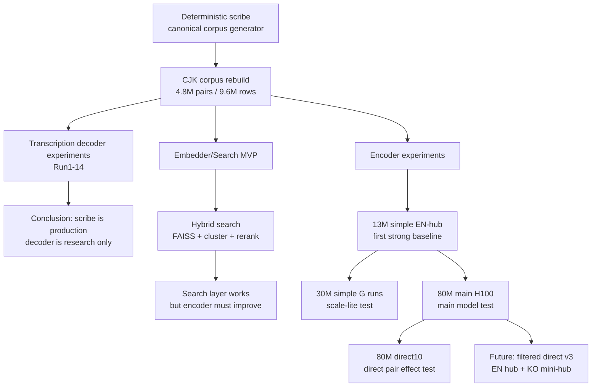

# Hunmin Experiment Map

작성일: 2026-05-03

이 문서는 Hunmin 전사기, 인코더, 검색 레이어 실험을 한 장으로 보기 위한 진행 도표다.

## 0. 큰 결론

| 영역 | 현재 판단 |
|---|---|
| 전사기 / scribe | production 기준. 더 이상 ML 전사기로 대체하지 않음 |
| 다국어 인코더 | `simple + clean + enough steps`가 승리 |
| 한국어 인코더 | 13M/80M 모두 가능성 있음. v7 mixed-English는 진행 중 |
| 검색 레이어 | lexical/cluster/rerank는 제품 품질에 필요하지만 인코더와 별도 |
| direct pair | raw WikiMatrix는 검증용으로만. 최종은 quality-filter 필요 |

## 1. 실험 흐름 요약



## 2. Chronological Table

| 순서 | 계열 | 실험 / 모델 | 크기 | 언어 | 데이터 | 핵심 결과 | 판단 |
|---:|---|---|---:|---:|---|---|---|
| 1 | scribe | Hunmin deterministic scribe | rule | 4+ | gold + rules | gold 100% 계열 | production 기준 |
| 2 | corpus | `corpus_cjk_v3_rebuild` | data | ko/ja/zh/en | 약 4.8M pair | drop 대폭 감소 | v1 corpus freeze 가능 |
| 3 | decoder | Run1-14 transcription decoder | 10M | 4 | corpus | 학습 가능성은 증명 | production 전사기는 아님 |
| 4 | embedder | Run1 phonetic/semantic embedder | 20M급 | 4 | 500K | 발음 정렬 강함 | 구조 검증 |
| 5 | search | FAISS + cluster + rerank | layer | 4 | 500K/2M index | hybrid R@1 0.9대 | 검색 레이어 성공 |
| 6 | lite encoder | `hunmin-lite-13m-7lang-enhub-textonly-simple-40k-run2` | 13.8M | 7 | EN-hub text-only | R@1 약 0.58 | 첫 강한 baseline |
| 7 | failed/lesson | STS 추가학습 계열 | 13M | ko/7 | STS mix | STS↑, retrieval R@1↓ | 목적 혼합 실패 |
| 8 | main encoder | `hunmin-main-80m-7lang-enhub2m-clean-h100-run1` | 80M | 7 | 2M EN-hub clean | best R@1 `0.8116` | 현재 다국어 최고 |
| 9 | direct test | `hunmin-main-80m-7lang-enhub2m-direct10-clean-h100-run1` | 80M | 7 | 2M + direct 200K | 진행 중, R@1 `0.8109` | direct 효과 검증 중 |
| 10 | ko encoder | `hunmin-ko-80m-1lang-corpus-v6-balanced-h100-run1` | 80M | 1 | KO corpus v6 | fixed3k에서 13M보다 강함 | 한국어 80M 기준점 |
| 11 | ko mixed | `hunmin-ko-80m-1lang-corpus-v7-mixed-english-h100-run1` | 80M | 1 | KO + mixed English | 진행 중, R@1 상승 | 영어 혼입 처리 실험 |
| 12 | small 30M | `g1 enhub2m simple 40K` | 30M | 7 | 2M clean | R@1 `0.6330` @18K | 13M 넘어서는 중 |
| 13 | small 30M | `g2 enhub3m simple 40K` | 30M | 7 | 3M clean | R@1 `0.6454` @18K | 30M 최상위 후보 |
| 14 | small 30M | `g4 enhub3m simple 40K seed2` | 30M | 7 | 3M clean | R@1 `0.6465` @18K | 30M 최상위 후보 |
| 15 | small 30M | `g3 enhub3m clean long20K` | 30M | 7 | 3M clean | final R@1 `0.6353` | baseline 완료 |
| 16 | small 30M | `g3 enhub3m simple 40K seed3` | 30M | 7 | 3M clean | 새로 시작 | seed 안정성 확인 |

## 3. 현재 다국어 Top Models

| 순위 | 모델 | 크기 | 방식 | best R@1 | 상태 |
|---:|---|---:|---|---:|---|
| 1 | `hunmin-main-80m-7lang-enhub2m-clean-h100-run1` | 80M | EN-hub 2M clean | `0.8116` | 완료 |
| 2 | `hunmin-main-80m-7lang-enhub2m-direct10-clean-h100-run1` | 80M | EN-hub 2M + direct10 | `0.8109` | 진행 중 |
| 3 | `hunmin-small-30m-7lang-enhub3m-textonly-simple-40k-g4-seed2-run1` | 30M | EN-hub 3M simple | `0.6465` | 진행 중 |

## 4. 중요한 교훈

| 발견 | 의미 |
|---|---|
| 13M simple이 먼저 강하게 올라감 | 구조보다 데이터/목표 단순성이 중요 |
| 30M simple도 상승 중 | 13M 우연이 아니라 recipe가 맞았음 |
| 80M 2M clean이 최고 | main line은 simple clean으로 유지 |
| direct10 전체 R@1은 아직 비슷 | raw direct는 만능이 아님 |
| `ko-zh` direct eval이 낮음 | WikiMatrix ko-zh 오염이 큼 |
| STS만 올리면 retrieval이 깨짐 | STS와 검색 objective는 분리 관리 필요 |

## 5. 다음 실험 순서

| 우선순위 | 작업 | 이유 |
|---:|---|---|
| 1 | direct10 완료 후 baseline 대비 direct pair 평가 | raw direct가 약한 언어쌍에 실제 도움 되는지 확인 |
| 2 | 모든 WikiMatrix direct pair 품질 리포트 작성 | ko-zh뿐 아니라 de-ko/fr-ko/es-ko도 점검 필요 |
| 3 | `direct_filtered_v3` 생성 | 오염 pair 제거 후 direct signal만 남김 |
| 4 | `EN hub + KO mini-hub` 데이터셋 구성 | 한국어 중심 제품에 맞는 허브 구조 |
| 5 | 30M simple 40K 완료 후 best 선정 | 노트북/lite 모델 후보 결정 |
| 6 | 80M filtered direct 재학습 | main model 성능 상한 확인 |

## 6. 방향 고정

현재까지의 최선 전략:

```text
simple architecture
+ clean EN-hub
+ 충분한 step
+ quality-filtered direct pairs
+ KO mini-hub
```

피해야 할 것:

```text
raw WikiMatrix 대량 투입
STS-only 추가학습
전사 auxiliary를 무리하게 섞기
검색 레이어 문제를 인코더 학습 문제로 착각하기
```

